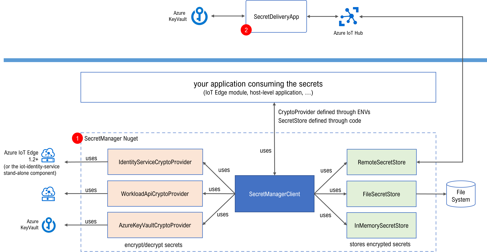

# Edge Secret Management

> DISCLAIMER: This repo does not contain production ready code or product but rather demonstrates an approach to managing secrets on the Edge.

INSPIRATION: currently there is no first party Microsoft solution for secret management on the Edge in the IoT Space. Still, there is a number of useful features in [IoT Edge](https://azure.microsoft.com/en-us/services/iot-edge/) and the [Azure IoT Identity Service](https://azure.github.io/iot-identity-service/) which can be used to build a custom secret management solution which is more secure then just storing secrets in a file in plain text.

## Overview

The Edge Secret Management solution includes:
1. the [SecretManager](./SecretManager/) component, which is responsible for managing the [secrets lifecycle](./SecretManager/README.md#secrets-lifecycle) at the Edge. Secrets are stored locally in a [SecretStore](./SecretManager/README.md#secrets-store) (in-memory and/or in a file), in an ecrypted format using one of the supported [Crypto Providers](./CryptoProvider/). 
2. the [SecretDeliveryApp](./SecretDeliveryApp/) app, which is responsible for retrieving the secrets from an Azure KeyVault and for delivering them to the SecretManager. Requests are sent by the edge SecretManager as a telemetry message via the Azure IoT Hub using this [contract](./docs/contracts.md).

## Get Started
* deploy and run the [end-2-end demo](./docs/e2e-demo.md)
* embed the [SecretManager](./SecretManager/) in your own application
* see the application [samples](./Samples/)

## Challenges
Here are **some** of the challenges that we identified while looking at the problem holistically:

1. **Secure storage** may or may not be available on the device.
2. **Secret delivery** - how to deliver secrets to a device in a secure way?
3. **Lifecycle management** - secrets may need to be e.g. deleted/updated and sometimes multiple systems can be involved. The whole process may or may not be well coordinated, changes can happen offline but there is still need to have a single pain of glass to manage those secrets.
4. **Observability** - it is necessary to know which secrets a device requested and is currently using.
5. **Auditability** - it is important to know who has access to secrets and who created/deleted/updated them.
6. **Access Control** - it is important to restrict access to the secrets. Not every device OR user should be able to access all secrets.
7. **Dev Experience** - what is the best way to deliver a solution for this problem? Should a be a library (e.g. NuGet package) or rather an IoT Edge module or a host level process which acts as a secret manager offering an API for secret access?
8. **Dependency on additional Cloud resources** - typically an IoT solution built on Azure contains an IoT Hub and Microsoft supports strong device authentication with this service. While it can be used (as we demonstrate in this demo) to send messages back and forth, one could also let devices and additional Azure service like e.g. Azure KeyVault to request secrets. Both approaches come with pros and cons. A few examples of things to consider:
   - Need for whitelisting additional URLs on the on-prem firewall or proxy
   - Scalability of the service to serve a high number of devices
   - Need for an additional secret to access the service
   - Is the RBAC mechanism used by the service enough and how does is scale with a growing number of devices?

## Known Issues
* [end-2-end demo](./docs/e2e-demo.md): we noticed that the SecretDelivery app occasionally fails (i.e. shutdowns/reboots) because of NGINX, which is used by the the [Azure Container Apps](https://azure.microsoft.com/en-us/services/container-apps/) at the ingress. The root cause may be occasional failures of the Azure Container Apps service, which is still in preview. That's just an educated guess and we didn't investigate it further.