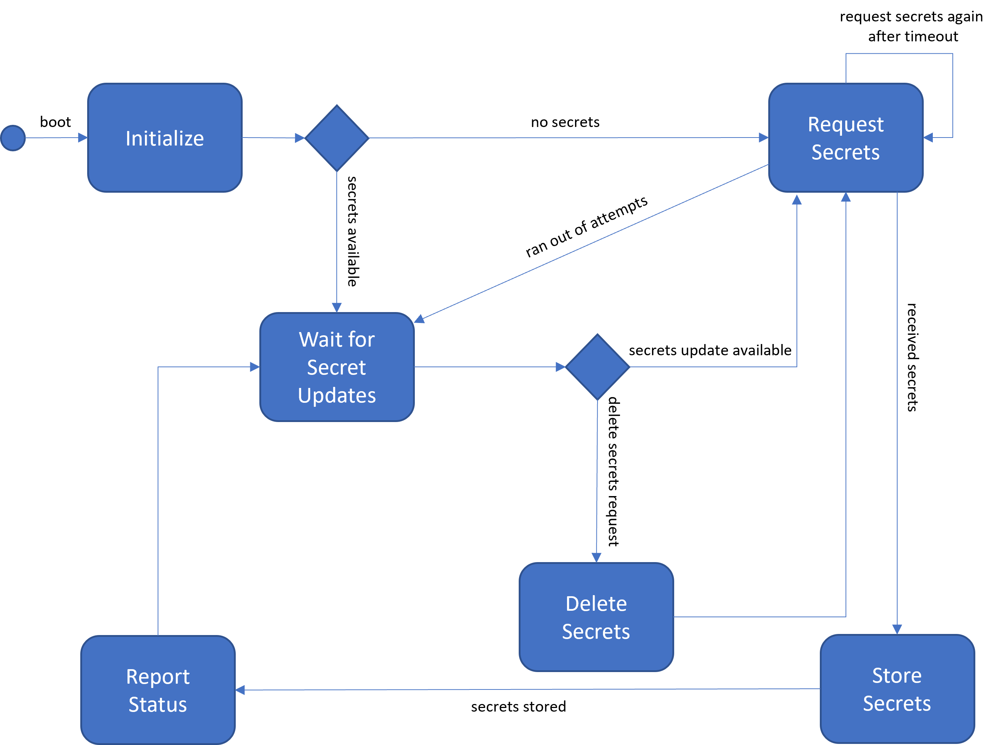
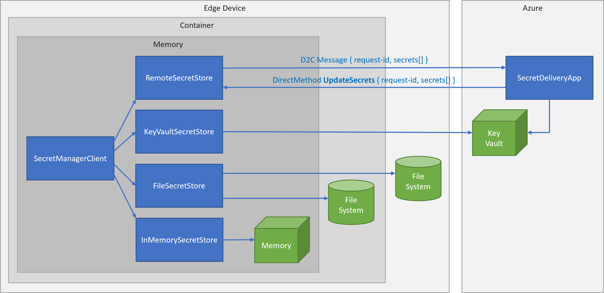

# SecretManager
To embed the SecretManager in your application:

* import the components:
    ```c#
    using EdgeSecrets.CryptoProvider;
    using EdgeSecrets.SecretManager;
    ```

* create a CryptoProvider (see [here](../CryptoProvider/README.md) for more information):
    ```c#
    cryptoProvider = new WorkloadApiCryptoProvider(initializationVector);

    // other options
    // cryptoProvider = new IdentityServiceCryptoProvider();
    // cryptoProvider = new AzureKeyVaultCryptoProvider();
    ```

* create a SecretManagerClient:
    ```c#
    string secretsFile = "/usr/local/cache/secrets.json";
    var secretManagerClient = new SecretManagerClient()
        .WithRemoteSecretStore(TransportType.Mqtt_Tcp_Only, new ClientOptions())
        .WithFileSecretStore(secretsFile, cryptoProvider, keyId)
        .WithInMemorySecretStore();
    Console.WriteLine("Secret manager client created.");
    ```

* get a secret:
    ```c#
    string? mySecretValue = await secretManagerClient.GetSecretValueAsync("mySecretName", null, DateTime.Now);
    ```

## Samples and demos
* [sample applications](../Samples/)
* [end-2-end solution](../docs/e2e-demo.md)

# Design
## Secrets lifecycle


## Secrets store


## Contracts
Secret request and response contract: [here](../docs/contracts.md)