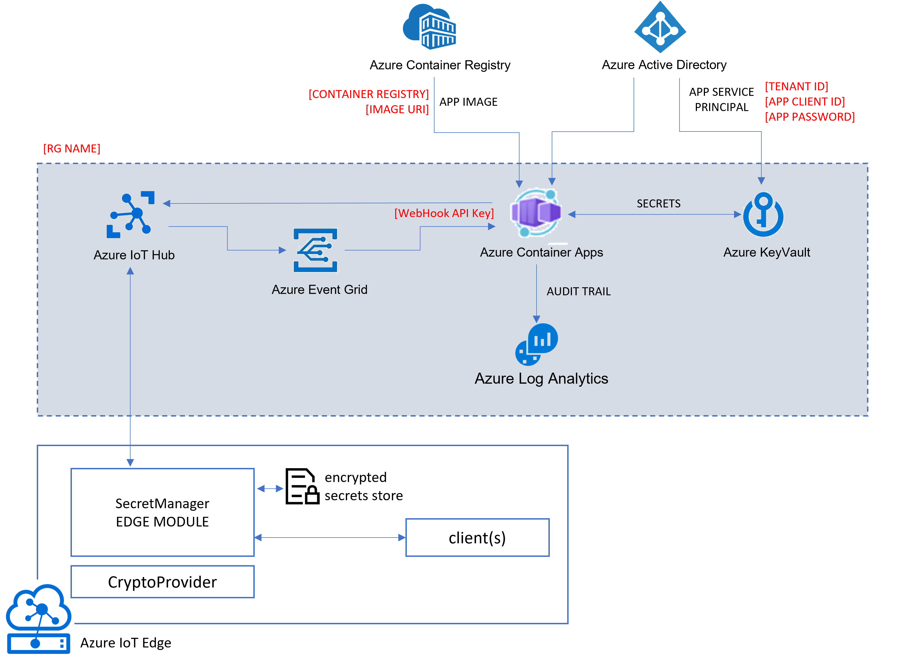

# Deploy all
To deploy the whole solution with all the services:

```bash
./deployAll.sh [RG Name] [Container Registry] [Image URI] [Tenant ID] [App Object ID] [App Client ID] [App Password] [WebHook API Key to use]
```

That script will deploy all the following services (except for Azure Key Vault, which is a pre-requisite):


Parameters:
* **[RG]**: the resource group name. 

    NOTE: It will be created in the northeurope region.

* **[WebHook API Key]**: an arbitrary string to use as the webhook API key.

* **[Container Registry]** and **[Image URI]** of the [SecretDeliveryApp](../SecretDeliveryApp). 

* **[Tenant ID]**, **[App Object ID]**, **[App Client ID]** and **[App Password]**

    The SecretDeliveryApp uses a service principal to access Azure KeyVault and Azure Container Registry. 

    
Example:
```bash
RG=<the-rg-you-want-to-deploy-to>               #example: "edge-secrets-rg"
APP_SP_NAME=<sp-name-to-create>                 #example: "mySecretDeliveryApp"
ACR_NAME=<existing-container-registry-name>     #example: "myacr.azurecr.io"
IMAGE_URI=<image-uri-to-use>                    #example: "edge-secrets/secret-delivery-app:0.0.1"
WEB_API_KEY=<webhook-api-key-to-use>            #example: "anyString"

# build and push the SecretDeliveryApp (see SecretDeliveryApp/README.md)
# NOTE: make sure you are in the project's root folder
docker build -t $ACR_NAME/$IMAGE_URI -f ./SecretDeliveryApp/Dockerfile .
docker push $ACR_NAME/$IMAGE_URI

# Obtain the full acr ID 
ACR_REGISTRY_ID=$(az acr show --name $ACR_NAME --query "id" --output tsv)

# create the service principal with "acrpull" access to the ACR.
# NOTE: password is shown only once. Make sure you save it!
APP_PASSWORD=$(az ad sp create-for-rbac --name $APP_SP_NAME --scopes $ACR_REGISTRY_ID --role acrpull --query "password" --output tsv)

# retrieve other ids
APP_OBJECT_ID=$(az ad sp list --display-name $APP_SP_NAME --query [0].objectId -o tsv)
APP_CLIENT_ID=$(az ad sp list --display-name $APP_SP_NAME --query [0].appId -o tsv)
APP_TENANT_ID=$(az ad sp list --display-name $APP_SP_NAME --query [0].appOwnerTenantId -o tsv)

# deploy
cd deployment
./deployAll.sh "$RG" "$ACR_NAME" "$ACR_NAME/$IMAGE_URI" "$APP_TENANT_ID" "$APP_OBJECT_ID" "$APP_CLIENT_ID" "$APP_PASSWORD" "$WEB_API_KEY"
```

# Deploy the container app only
To deploy the container app only (TODO: setup Continuous Deployment from GitHub):

```bash
./deployApp.sh [RG Name] [Container Registry] [Image URI] [Tenant ID] [App Client ID] [App Password] [WebHook API Key to use] [Azure KeyVault URL] [KubeEnvironment Resource ID]

```

> KubeEnvironment Resource ID looks similar to this:  
>
> /subscriptions/[SUB ID]/resourceGroups/[RG NAME]/providers/Microsoft.Web/kubeEnvironments/[K8s ENV NAME]

