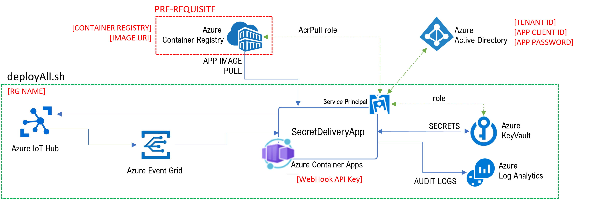

# Deploy all
To deploy the whole solution with all the services:

```bash
./deployAll.sh [RG Name] [Container Registry] [Image URI] [Tenant ID] [App Object ID] [App Client ID] [App Password] [WebHook API Key to use]
```

That script will deploy all the services in the rectangle:


Parameters:
* **[RG]**: the resource group name. 

    NOTE: It will be created in the northeurope region.

* **[WebHook API Key]**: an arbitrary string to use as the webhook API key.

* **[Container Registry]** and **[Image URI]** of the SecretDeliveryApp. 

    Look [here](../SecretDeliveryApp) to build and upload the image.
* **[Tenant ID]**, **[App Object ID]**, **[App Client ID]** and **[App Password]**

    The SecretDeliveryApp uses a service principal to access Azure KeyVault and Azure Container Registry. To create a service principal and get those info:

   ```bash
   az ad sp create-for-rbac -n "mySecretDeliveryApp" --skip-assignment
   ```

   Sample output:
   ```bash
   {
    "appId": "7bb1XXXX-f6XX-4116-884f-XXXXXXXXXXXX", # --> [App Object ID]
    "displayName": "mySecretDeliveryApp", # --> [App Client ID]
    "password": "nK8dVa~TfHJY-uTR-D7RK8BQ_P_XXXXXXX", # --> [App Password]
    "tenant": "72f9XXXX-86XX-41af-XXXXXXXXXXXX" # --> [Tenant ID]
   }
   ```


Example:
```bash
./deployAll.sh "edge-secrets-rg" "arlotito.azurecr.io" "edge-secrets/secret-delivery-app:0.0.1" "72f9XXXX-86XX-41af-XXXXXXXXXXXX" "7bb1XXXX-f6XX-4116-884f-XXXXXXXXXXXX" "mySecretDeliveryApp" "nK8dVa~TfHJY-uTR-D7RK8BQ_P_XXXXXXX" "anyString"
```

# Deploy the container app only
To deploy the container app only (TODO: setup Continuous Deployment from GitHub):

```bash
./deployApp.sh [RG Name] [Container Registry] [Image URI] [Tenant ID] [App Client ID] [App Password] [WebHook API Key to use] [Azure KeyVault URL] [KubeEnvironment Resource ID]

```

> KubeEnvironment Resource ID looks similar to this:  
>
> /subscriptions/[SUB ID]/resourceGroups/[RG NAME]/providers/Microsoft.Web/kubeEnvironments/[K8s ENV NAME]

