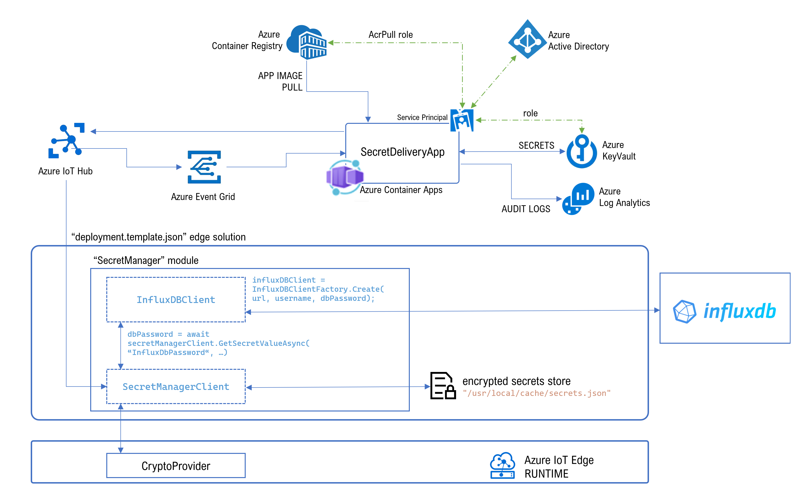
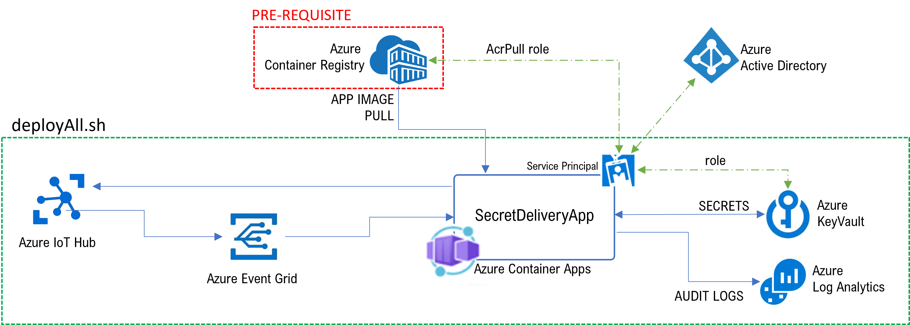

# pre-requisite
An Azure Container Registry is required to run the demo.

# deploy the cloud solution
Deploy the cloud solution as explained in [deployment/README.md](../deployment/README.md), i.e.:

```bash
RG=<the-rg-you-want-to-deploy-to>               #example: "edge-secrets-rg"
APP_SP_NAME=<sp-name-to-create>                 #example: "mySecretDeliveryApp"
ACR_NAME=<existing-container-registry-name>     #example: "myacr.azurecr.io"
IMAGE_URI=<image-uri-to-use>                    #example: "edge-secrets/secret-delivery-app:0.0.1"
WEB_API_KEY=<webhook-api-key-to-use>            #example: "anyString"

# build and push the SecretDeliveryApp (see SecretDeliveryApp/README.md)
# NOTE: make sure you are in the project's root folder
docker build -t $ACR_NAME/$IMAGE_URI -f ./SecretDeliveryApp/Dockerfile .
docker push $ACR_NAME/$IMAGE_URI

# Obtain the full acr ID 
ACR_REGISTRY_ID=$(az acr show --name $ACR_NAME --query "id" --output tsv)

# create the service principal with "acrpull" access to the ACR.
# NOTE: password is shown only once. Make sure you save it!
APP_PASSWORD=$(az ad sp create-for-rbac --name $APP_SP_NAME --scopes $ACR_REGISTRY_ID --role acrpull --query "password" --output tsv)

# retrieve other ids
APP_OBJECT_ID=$(az ad sp list --display-name $APP_SP_NAME --query [0].objectId -o tsv)
APP_CLIENT_ID=$(az ad sp list --display-name $APP_SP_NAME --query [0].appId -o tsv)
APP_TENANT_ID=$(az ad sp list --display-name $APP_SP_NAME --query [0].appOwnerTenantId -o tsv)

# deploy
cd deployment
./deployAll.sh "$RG" "$ACR_NAME" "$ACR_NAME/$IMAGE_URI" "$APP_TENANT_ID" "$APP_OBJECT_ID" "$APP_CLIENT_ID" "$APP_PASSWORD" "$WEB_API_KEY"
```



# create secrets in Azure KeyVault
The sample application [SecretManager.Edge](../Samples/SecretManager.Edge/Program.cs) will fetch the secret "InfluxDbUsername" and "InfluxDbPassword" from the Azure KeyVault and will use it to access the sample InfluxDB.

First, you may need to grant your user access to the KeyVault.
```bash
# your user name
USER_NAME="<mail>" #example: "me@microsoft.com"

# get KV name
KV_NAME=$(az keyvault list -g "$RG" --query [0].name -o tsv)

# assign permissions to the user
MY_OBJECT_ID=$(az ad user show --id "$USER_NAME" --query objectId -o tsv)
az keyvault set-policy --name $KV_NAME --object-id $MY_OBJECT_ID --secret-permissions delete get list set
```

Then, create the secrets
```bash
# create the secret "InfluxDbPassword"
az keyvault secret set --name "InfluxDbPassword" --vault-name $KV_NAME --value "my-password"

# create the secret "InfluxDbUsername"
az keyvault secret set --name "InfluxDbUsername" --vault-name $KV_NAME --value "my-user"
```

# provision an iot edge 
Let's create a VM, install Azure IoT Edge 1.2 and connect it to the IoT Hub.

```bash
# get iot hubname
IOT_HUB_NAME=$(az iot hub list -g "$RG" --query [0].name -o tsv)

# provision vm with iot edge 1.2
curl -L https://raw.githubusercontent.com/arlotito/vm-iotedge-provision/dev/scripts/vmedge.sh | bash -s -- \
    -s Standard_DS2_v2 \
    -g $RG -l northeurope \
    -e 1.2 \
    -n $IOT_HUB_NAME \
    -u "azuser"
```

# deploy the edge solution

1. create an ".env" file based on the [.env.sample](../Samples/.env.sample) file and edit it to point at your Azure Container Registry:

  ```bash
  ACR_ADDRESS=<myAcr>.azurecr.io
  ACR_USER=<myuser>
  ACR_PASSWORD=<mypassword>

  EDGESECRET_CRYPTO_PROVIDER="WorkloadApi"
  EDGESECRET_INIT_VECTOR="1234567890"
  INFLUXDB_URL=http://localhost:8086
  INFLUXDB_ORG=my-org
  INFLUXDB_BUCKET=my-bucket
  ```
2. build and push the [deployment.template.json](../Samples/deployment.template.json) edge solution
3. deploy the solution to the iot edge vm

This edge solution includes:
* a module "SecretManager", with a sample application that 
  * will fetch the secrets "InfluxDbUsername" and "InfluxDbPassword" from the AKV (via IoT Hub) and will use it to connect to the InfluxDb server
  * will query and print the content of the bucket


# ssh into the iot edge VM 
```bash
# connect to the iot edge VM
VM_NAME=$(az vm list -g $RG --query [0].name -o tsv)
ssh azuser@$VM_NAME.northeurope.cloudapp.azure.com -i $HOME/.ssh/vmedge.key
```

# run InfluxDb

```bash
docker run -p 8086:8086 \
      -v /var/lib/influxdb/config:/etc/influxdb2 \
      -v /var/lib/influxdb/data:/var/lib/influxdb2 \
      -e DOCKER_INFLUXDB_INIT_MODE=setup \
      -e DOCKER_INFLUXDB_INIT_USERNAME=my-user \
      -e DOCKER_INFLUXDB_INIT_PASSWORD=my-password \
      -e DOCKER_INFLUXDB_INIT_ORG=my-org \
      -e DOCKER_INFLUXDB_INIT_BUCKET=my-bucket \
      --name influxdb \
      influxdb:2.0
```

# populate influxdb

populate influxdb with some datapoints:

```bash
containerid="$(sudo docker ps -aqf name=influxdb)"
sudo docker exec $containerid influx write -b my-bucket -o my-org -p s 'myMeasurement,host=myHost testField="testData1" 1556896377'
sudo docker exec $containerid influx write -b my-bucket -o my-org -p s 'myMeasurement,host=myHost testField="testData2" 1556896399'
sudo docker exec $containerid influx write -b my-bucket -o my-org -p s 'myMeasurement,host=myHost testField="testData3" 1556896469'
```

# run the demo  
Run the following commands.

1. start the edge device and wait for all modules to be running
2. get id of the docker container
  ```bash
  containerid="$(sudo docker ps -aqf name=SecretManager)"
  ```
3. remove the container file cache
  ```bash
  sudo docker exec $containerid rm /usr/local/cache/secrets.json
  ```
4. restart the SecretManager module
  ```bash
  sudo iotedge restart SecretManager
  ```
5. show the SecretManager module logs
  ```bash
  sudo iotedge logs SecretManager --since 5m
  ```

  This will show logging information similar to:
  

  From this log, you can see that a remote request is sent to retrieve the secret, and when retrieved it is stored in the container file.

6. show the secrets files
  ```bash
  # show container files
  sudo docker exec $containerid ls -l /usr/local/cache

  # show the content of the container file:
  sudo docker exec $containerid cat /usr/local/cache/secrets.json
  ```

  You will get something like:
  ```
  {"InfluxDbPassword":{"6769a77965264fa9a41b6b6e5d64654e":{"Name":"InfluxDbPassword","Value":"AiRdKfOVR5nrp4hC4X\u002BYr/CQMynmnQ76bipeQ4wJOP/vLPNYYj12dTAG3doSVT14GxAPCs08aD6v\u002BTkUK5XK7OJ7XmPx\u002Bbj92fH5mZ6716WiEtIzGlAGOXYn\u002BJ3L7edy5Tb45SkUMTGgB14QQqV1qWL79HPtM/vaKFX5VEIVigqzSCTANXGJwE5Ktvx1DTev3eNSyhuNoPHO7pRf8/PDOhmqWZ2Sut8ZZIpopPraKEUE7WirXPtse64ZjBn13lLzsH02BbgGsZVW65Y49iOxpacvtEoy/ARlnQQkUgbCaJYbH3p2d51PUhOiTZLjSDjelvafc5kirvE\u002BGHdQyEORT\u002BRilEll","Version":"6769a77965264fa9a41b6b6e5d64654e","ActivationDate":"0001-01-01T00:00:00","ExpirationDate":"9999-12-31T23:59:59.9999999"}}}
  ```

# view the SecretDeliveryApp logs
SecretDeliveryApp posts the logs into the table "ContainerAppConsoleLogs_CL" of Logs Analytics.

Use the following query:
```
ContainerAppConsoleLogs_CL
| where Message startswith "Delivering secrets: "
| extend tokens = split(Message, " ")
| extend device = tokens[5]
| extend secret = tokens[2]
| project TimeGenerated, device, secret
```


