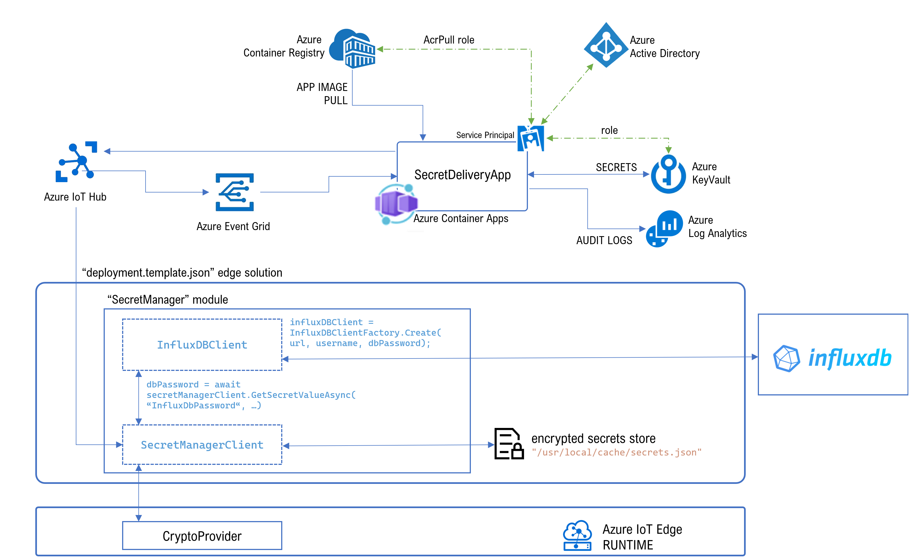

# Edge Secrets project samples

The Edge Secrets project contains sample applications to demonstrate the use of the Secret Manager components.

## SecretManager.Edge

The [SecretManager.Edge](../Samples/SecretManager.Edge) sample is an IoT Edge Module that will use the SecretManager components to retrieve a connection string to a database and read product informtion.



After building and installing the module, and setting upo the cloud components, use the following steps to run demonstrate the working of the Secret Manager. On the Edge device, run the following commands.

1. Run InfluxDb cotnainer e.g, like this:

   ```bash
   docker run -p 8086:8086 \
         -v /var/lib/influxdb/config:/etc/influxdb2 \
         -v /var/lib/influxdb/data:/var/lib/influxdb2 \
         -e DOCKER_INFLUXDB_INIT_MODE=setup \
         -e DOCKER_INFLUXDB_INIT_USERNAME=my-user \
         -e DOCKER_INFLUXDB_INIT_PASSWORD=my-password \
         -e DOCKER_INFLUXDB_INIT_ORG=my-org \
         -e DOCKER_INFLUXDB_INIT_BUCKET=my-bucket \
         --name influxdb \
         influxdb:2.0
   ```

2. start the edge device and wait for all modules to be running

2. get id of the docker container
```bash
containerid="$(sudo docker ps -aqf name=SecretManager)"
```

3. remove the container file cache
```bash
sudo docker exec $containerid rm /usr/local/cache/secrets.json
```

4. restart the SecretManager module
```bash
sudo iotedge restart SecretManager
```

5. show the SecretManager module logs
```bash
sudo iotedge logs SecretManager --since 5m
```
This will show logging information similar to:
```
IoT Hub module client initialized.
Get data from database.
Using initialization vector 1234567890
Using Crypto Provider EdgeSecrets.CryptoProvider.WorkloadApiCryptoProvider
Secret manager client created.
Send request for secrets with id 'f21c5f6b-fa2f-4a44-bdd0-df8c17143896'
Received update of secrets for RequestId 'f21c5f6b-fa2f-4a44-bdd0-df8c17143896' (1 secret(s) received)
Add secret to file /usr/local/cache/secrets.json, file now contains 1 secrets
Reading secrets from file /usr/local/cache/secrets.json (1 secrets found)
Send request for secrets with id 'b3e25d57-c536-425c-8008-7551b10dbddd'
Received update of secrets for RequestId 'b3e25d57-c536-425c-8008-7551b10dbddd' (1 secret(s) received)
Add secret to file /usr/local/cache/secrets.json, file now contains 2 secrets
Valid secret found.
2019-05-03T15:12:57Z: testData1
2019-05-03T15:13:19Z: testData2
2019-05-03T15:14:29Z: testData3
```
From this log, you can see that a remote request is sent to retrieve the secret, and when retrieved it is stored in the container file.

6. show the container files
```bash
sudo docker exec $containerid ls -l /usr/local/cache
```
And show the content of the container file:

```bash
sudo docker exec $containerid cat /usr/local/cache/secrets.json
```

```
{"InfluxDbUsername":{"4c70b874c8bf4035938280b36a2dc92e":{"Name":"InfluxDbUsername","Value":"AuUG/VWdsBg3zMsTg3Uqom/DPqduJk6Q","Version":"4c70b874c8bf4035938280b36a2dc92e","ActivationDate":"0001-01-01T00:00:00","ExpirationDate":"9999-12-31T23:59:59.9999999"}},"InfluxDbPassword":{"0ef47aab7e464c03b38431e691668977":{"Name":"InfluxDbPassword","Value":"Atg/o1OZ5RhZ8vnfYy8GVBLyu5msGNSHVQ==","Version":"0ef47aab7e464c03b38431e691668977","ActivationDate":"0001-01-01T00:00:00","ExpirationDate":"9999-12-31T23:59:59.9999999"}}}
```

## SecretManager.Host - Azure IoT Identity Service sample

IoT Edge 1.2.x already comes bundled with Azure IoT Identity Service. If you prefer a standalone installation, please follow [these instructions](https://azure.github.io/iot-identity-service/) to install and configure it. To ensure your process can access the Identity Service make sure to configure [client authorization](https://azure.github.io/iot-identity-service/develop-an-agent.html#client-authorization) for identityd and keyd. `/etc/aziot/identityd/config.d/mymodule.toml`could look like this:

```bash
[[principal]]
uid = 1000
name = "mymodule"
idtype = ["module"]
```

and `/etc/aziot/keyd/config.d/mymodule.toml` like this:

```bash
[[principal]]
uid = 1000
keys = ["mysymmtestkey"]
```

Next step is to let the Identity Service generate a symmetric key which will be used to encrypt the secrets at rest. Use [this API](https://azure.github.io/iot-identity-service/api/keys-service.html#generate-new-symmetric-key) to do this:

```bash
curl -X POST -H 'Content-Type: application/json' -d '{"keyId": "mysymmtestkey", "usage": "encrypt"}'  --unix-socket /run/aziot/keyd.sock http://keyd.sock/key?api-version=2020-09-01
```

 Run [the sample](../Samples/SecretManager.Host) providing the following environment variables:

```bash
EDGESECRET_KEYID=mysymmtestkey
EDGESECRET_CRYPTO_PROVIDER=IdentityService
INFLUXDB_URL=http://<IP Address or Hostname>:8086
INFLUXDB_ORG=my-org
INFLUXDB_BUCKET=my-bucket
```
